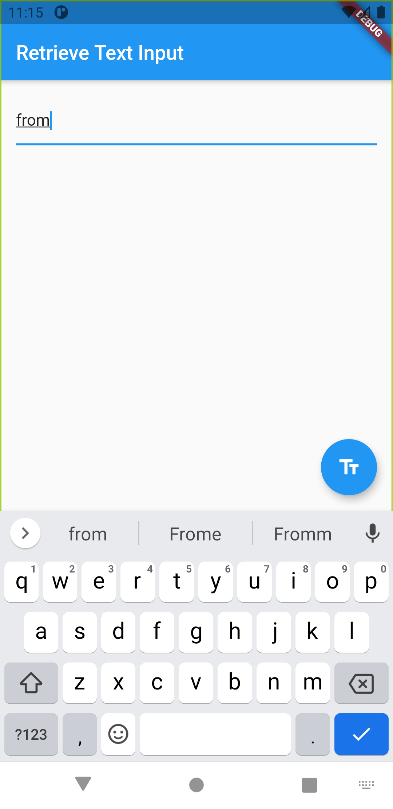

# retrieve_value

1. Create a TextEditingController
2. Supply the TextEditingController to a TextField
3. Display the current value of the text field
4.  Interactive example

<table>
  <tr>
    <td>Value in Textfield</td>
     <td>On Press</td>
  </tr>
  <tr>
    <td></td>
    <td></td>
  </tr>
 </table>